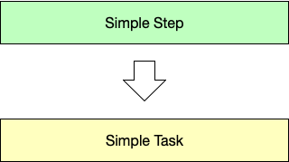
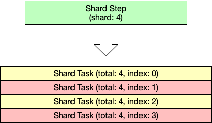

# Job Define Config

## Job Define

Job define files are pre-defined in the `jobDefine` folder in your application resources path. Here `jobDefine` folder is configured as `tascreed.define.dirs` by default, you can also overwrite the folder or append some more folders.  
Tumbler application will try to load all the job define files, after parse and validation, register the job defines into memory.  
Each job define file describes a job template, to define what it is and how it works.  

Job define file sample
```
{
  "jobName": "sample",
  "version": 1,
  "priority": 10,
  "uniqueAliveInstance": true,
  "params": {
    "k1": "v1",
    "k2": "v2"
  },
  "steps": [...]
}
```

| Field Name | Description | Type | Mandatory | Default Value |
| ----- | ----- | ----- | ----- | ----- |
| jobName | the name of job define, it should be unique, or it might be overwritten by the other jobs with the same job name, which is always unexpected. To create jobs, TasCreed will find the job define by `jobName`. | `string` | Yes | |
| version | the job define version, to indicate the differen job define versions, not in use now. | `long` | No | `0` |
| priority | the priority of the job define, the job instance and tasks created by this job defin will inherit the priority value. TasCreed executors will firstly to pick tasks with larger priority value. | `int` | No | `0` |
| uniqueAliveInstance | if `true`, at most one alive job instance of this job define can be created at the same time; otherwise, more than one job instances of this job define can be created at the same time. | `boolean` | No | `false` |
| params | the parameters of job level, all the job instances of this job define will inherit the job parameters. | `map<string, string>` | No | `Null` |
| steps | the step define list of the job define, to describe all the steps in this job. In theory, it can be empty; but normally we don't want to create a job without any step, which means no task can be created, and no TasCreed executor works. | `list<StepDefine>` | No | `empty list` |

## Step Define

Step define describes a step of a job define, to define what it is and how it works.  
There are several step types:
- SIMPLE: default step type, only one task can be created
- SHARD: several tasks can be created in sharding mode
- PACK: several tasks can be created in pack mode

### Simple mode step



sample of simple mode step
```
{
  "stepName": "prep",
  "stepType": "SIMPLE",
  "dependentStep": "first",
  "params": {
    "k1": "v11", 
    "k2": "v22"
  }
}
```

With `stepType` set as `SIMPLE` or not set by default, the step will be recognized as a simple mode step.

The basic fields:
| Field Name | Description | Type | Mandatory | Default Value |
| ----- | ----- | ----- | ----- | ----- |
| stepName | the name of step define, it should be unique inside of job define, or it might be wrong when find step by name. alias `name`. | `string` | Yes | |
| stepType | the step type, to indicate the step working mode. Current supported step types are `SIMPLE`, `SHARD` and `PACK`. alias `type`. | `enum` | No | `SIMPLE` |
| dependentStep | previous dependent step name of this step, it means this step can start only after the dependent step succeeded. | `string` | No | |
| params | the parameters of step level, all the tasks of this step will inherit the step parameters. | `map<string, string>` | No | `Null` |

The advanced fields:
| Field Name | Description | Type | Mandatory | Default Value |
| ----- | ----- | ----- | ----- | ----- |
| exeClass | if you want to different task executor other than the registered, you can overwrite this field with the executor full class name. | `string` | No | |
| affinityRule | when scheduling the task worker node, the affinity rule can help decide which node to pick which tasks. The affinity rule can be implemented by users, enabled after registered in code. | `string` | No | |
| ignorable | if true, this step can be ignored if this step is set `ignore` in job request; if false, this step is not ignorable in any case. | `boolean` | No | `false` |
| effort | to define the effort of this step, used for working progress percentage calculation of the whole job. | `int` | No | `1` |

### Shard mode step



sample of shard mode step
```
{
  "stepName": "calc",
  "stepType": "SHARD",
  "shardConf": {
    "shard": 4
  }
}
```

With `stepType` set as `SHARD`, the step will be recognized as a shard mode step.

The step define fields are the same as simple mode, with one more shard mode configuration field `shardConf`. In `shardConf`, the fields are:
| Field Name | Description | Type | Mandatory | Default Value |
| ----- | ----- | ----- | ----- | ----- |
| maxTaskCount | the max alive task number of this step at the same time. The value should be more than 0, and it is recommended to be less than `100`. | `int` | No | `50` |
| shard | the total sharding number N of this step. TasCreed will create N task instances for this step, with different shard id in each task instance. The value should be more than 0. | `int` | Yes | |
| startShardId | the start shard id of created shard tasks. | `int` | No | `0` |

### Pack mode step


sample of pack mode step
```
{
  "stepName": "calc",
  "stepType": "PACK",
  "packConf": {
    "size": 100,
    "start": 0,
    "end": 1005,
    "maxTaskCount": 6
  },
  "dependentStep": "prep",
  "ignorable": true,
  "effort": 5
}
```

With `stepType` set as `PACK`, the step will be recognized as a pack mode step.

The step define fields are the same as simple mode, with one more pack mode configuration field `packConf`. In `packConf`, the fields are:
| Field Name | Description | Type | Mandatory | Default Value |
| ----- | ----- | ----- | ----- | ----- |
| maxTaskCount | the same as `maxTaskCount` field in `shardConf`. | `int` | No | `50` |
| size | the size of each pack. The value should be more than 0. | `long` | Yes | |
| start | the start point of the whole range, included. The value should not be negative. | `long` | Yes | |
| end | the end point of the whole range, included. The value should not be negative if the step is not infinite; and it is optional if the step is infinite. | `long` | Yes | |
| infinite | if true, this pack step will ignore `end` field, when create pack task instances, there's no end point, so the packs can be created forever. | `boolean` | No | `false` |
| startPackId | the start pack id of created pack tasks. | `long` | No | `0` |

#### Infinite pack mode step

This is a special usage of pack mode step, if we set `infinite` as true, TasCreed will ignore the `end` field, and generate infinite packs.


